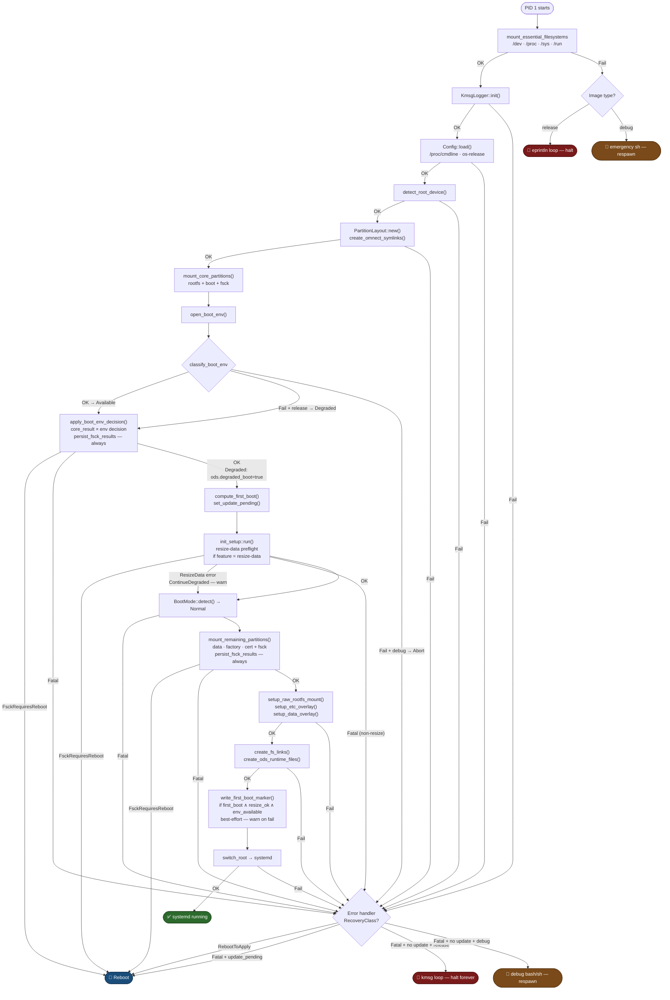

# omnect-os-init

Rust-based init process for omnect-os initramfs.

## Overview

Replaces 14 bash-based initramfs scripts (~1500 LOC) with a single Rust binary
acting as `/init` in the initramfs. Runs as PID 1 before `switch_root`.

Implemented functionality:

- **Bootloader abstraction**: Unified `BootEnv` trait for GRUB (`grub-editenv`) and U-Boot (`fw_printenv`/`fw_setenv`); fsck output persisted across reboots as gzip+base64 in the bootloader env (encoded via busybox `gzip`/`base64` — no crate dependencies)
- **Degraded boot mode**: When the bootloader environment is unavailable (corrupted env file, missing tool, I/O error), release images continue booting and flag `degraded_boot: true` in the ODS status JSON; debug images abort immediately and drop to a shell. `FsckRequiresReboot` always takes precedence over a concurrent bootloader failure.
- **Configuration**: Parses `/proc/cmdline`; build-time constants from Yocto environment via `build.rs`
- **Partition management**: Root device detection, partition layout (GPT/DOS), `/dev/omnect/*` symlinks
- **Filesystem operations**: fsck, mount manager (RAII), overlayfs for `/etc` and `/home`, bind mounts
- **Logging**: Kernel ring buffer (`/dev/kmsg`) with log level prefixes
- **ODS integration**: Runtime files for `omnect-device-service`
- **fs-links**: Symlink creation from `etc/omnect/fs-link.json` and `etc/omnect/fs-link.d/`
- **switch\_root**: MS_MOVE + chroot + exec systemd (`pivot_root(2)` is not used; ramfs does not support it)

Not yet implemented (planned):

- Factory reset (backup, wipe, restore)
- Flash modes (disk clone, network, HTTP/HTTPS)

## Startup Flow

The diagram traces every phase from PID 1 start to `switch_root`. The `release-image`
feature flag determines the error-handling branch at each fatal failure point.



**Terminal states**

| Symbol | Outcome | Trigger |
|--------|---------|---------|
| ✅ | `switch_root` — systemd takes over | Normal completion |
| 🔁 | Reboot | `FsckRequiresReboot` (unconditional); or any fatal error while `omnect_validate_update` is set — triggers bootloader OTA rollback |
| 🔴 | Halt (kmsg loop, infinite) | Fatal error · release image · no OTA in flight |
| 🐚 | Debug shell (bash → sh fallback, respawning) | Fatal error · debug image · no OTA in flight |

**Notes on error handling**

All errors from `run_init()` reach `handle_fatal_error` in `main.rs`, which dispatches on
`RecoveryClass`:
- `RebootToApply` (e.g. `FsckRequiresReboot`) → always Reboot, regardless of image type
- `Fatal` + `omnect_validate_update` set → Reboot (bootloader OTA rollback)
- `Fatal` + no OTA in flight + release → Halt (kmsg loop)
- `Fatal` + no OTA in flight + debug → debug shell

`FsckRequiresReboot` edges in the diagram flow through this handler — not via a separate
mechanism.

**Notes on `apply_boot_env_decision`**

`mount_core_partitions` result is captured rather than propagated immediately so that
fsck diagnostics can be persisted to the bootloader environment before any reboot.
`apply_boot_env_decision` enforces the invariant that `FsckRequiresReboot` always wins
over a concurrent `DegradedBoot` — the two failure modes can co-occur when GRUB's
boot partition is unmountable. `persist_fsck_results` runs on every mount path,
including degraded boot.

## Building

```bash
# Debug build (bootloader type must be specified)
cargo build --features grub     # x86-64 EFI targets
cargo build --features uboot    # ARM targets

# Release build (optimized for size)
cargo build --release --features grub
cargo build --release --features uboot

# With additional optional features
cargo build --release --features "grub,persistent-var-log"
```

## Features

| Feature | Description | Status |
|---------|-------------|--------|
| `core` | Core boot sequence (default) | Implemented |
| `grub` | GRUB bootloader support — x86-64 EFI targets | Implemented |
| `uboot` | U-Boot bootloader support — ARM targets | Implemented |
| `gpt` | GPT partition table layout | Implemented |
| `dos` | DOS/MBR partition table layout | Implemented |
| `persistent-var-log` | Bind-mount `/var/log` to data partition | Implemented |
| `release-image` | Release error handling: loop on fatal error; continue in degraded boot | Implemented |
| `resize-data` | Data partition auto-resize on first boot | Implemented |
| `test-utils` | Expose `MockBootEnv` for integration tests (never enabled in production) | Test only |
| `factory-reset` | Factory reset support | Planned |
| `flash-mode-1` | Disk cloning | Planned |
| `flash-mode-2` | Network flashing | Planned |
| `flash-mode-3` | HTTP/HTTPS flashing | Planned |

> **Note:** `grub` and `uboot` are mutually exclusive. Exactly one must be set at build time.
> The Yocto recipe selects the correct feature via `CARGO_FEATURES` based on `MACHINE_FEATURES`.

## Testing

```bash
# All four valid base combinations (bootloader × partition table)
# test-utils is required to include the degraded_boot integration tests
cargo test --features grub,gpt,test-utils
cargo test --features grub,dos,test-utils
cargo test --features uboot,gpt,test-utils
cargo test --features uboot,dos,test-utils

# With resize-data feature
cargo test --features grub,gpt,resize-data,test-utils
cargo test --features grub,dos,resize-data,test-utils
cargo test --features uboot,gpt,resize-data,test-utils
cargo test --features uboot,dos,resize-data,test-utils

# With release-image feature
cargo test --features grub,gpt,release-image,test-utils
cargo test --features grub,dos,release-image,test-utils
cargo test --features uboot,gpt,release-image,test-utils
cargo test --features uboot,dos,release-image,test-utils

# With both resize-data and release-image
cargo test --features grub,gpt,resize-data,release-image,test-utils
cargo test --features uboot,gpt,resize-data,release-image,test-utils

# Verbose output
cargo test --features grub,gpt,test-utils -- --nocapture
```

## License

MIT OR Apache-2.0
